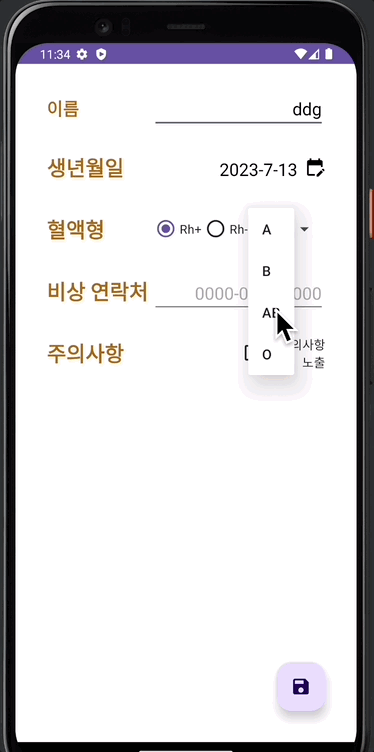

# 📢 응급의료정보

---
## 📌 개요
- 구현기능
  - 다양한 유저정보
    - 이름
    - 생년월일
    - 혈액형
    - 비상연락처
    - 기타
  - 화면 전환
  - 다른 앱 실행
  - 데이터 저장

 

 

---
## 💪🏻 학습 목표
- 다양한 위젯을 사용하고, 테마를 이용하여 일관성 있는 UI를 그릴 수 있음
- UI
  - ConstraintLayout
  - Style - Theme
  - ImageView
  - RadioButton
  - CheckBox
  - Spinner
  - DatePicker
  - Toolbar
- Kotlin
  - const val
- Android
  - Manifest
  - SharedPreference
  - Intent
    - 화면 전환
    - 전화 앱 실행
  - Toast

---
## 🚶🏻한 걸음 더
- Intent 로 할 수 있는 다양한 동작에 대해 학습해보기
  - https://developer.android.com/reference/android/content/Intent?hl=ko
- Manifest 에 들어가는 다양한 값들에 대해 학습해보기
  - https://developer.android.com/guide/topics/manifest/manifest-intro#reference
- Kotlin 의 다양한 ScopeFunction 에 대해 학습해보기
  - https://kotlinlang.org/docs/scope-functions.html