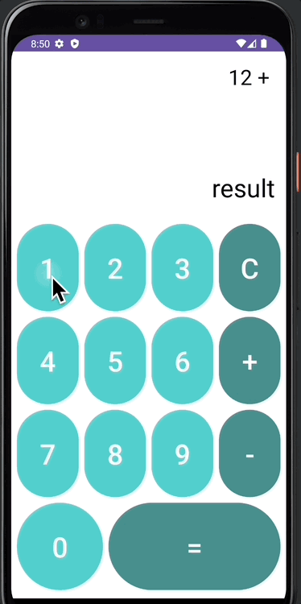

# 📢 계산기 앱

---
## 📌 개요
- 계산기 UI 그리기
- 계산 기능 구현하기

 

 

---
## 💪🏻 학습 목표
- 계산기 UI를 그리고, 간단한 계산 기능을 구현할 수 있음
  - TableLayout이 아닌, ConstraintLayout-Flow로 계산기 UI 그리기
  - 다크/라이트 모드에 따른 UI 그리기
- UI
  - ConstraintLayout - Flow
  - style
  - color(Light/Dark)
  - theme
- Kotlin
  - when
  - StringBuilder
  - BigDecimal
  - DecimalFormat

 

---
## 🚶🏻 한 걸음 더
- String vs StringBuilder 언제 사용하는게 좋은지 공부해보기
  - 많은 양의 문자열 변경이 일어나는 경우 StringBuilder를 사용하는 것이 좋음
- 직접 계산기 구현해보