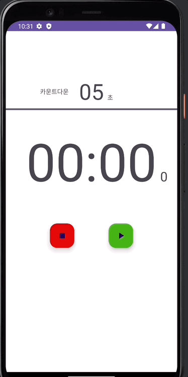
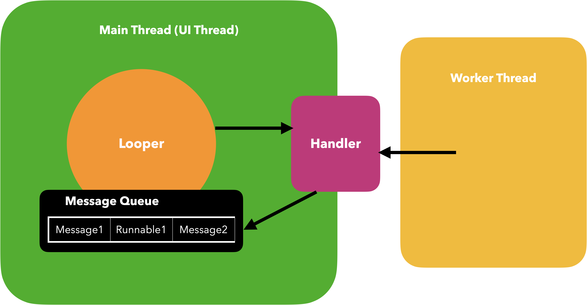

# 📢 스톱워치

---
## 📌 개요
- 구현기능
  - 스톱워치 기능
    - 0.1초마다 숫자 업데이트
    - 시작, 일시정지, 정지
    - 정지 전 다이얼로그 알람
  - 시작 전 카운트 다운 추가
  - 카운트 다운 3초전 알림음
  - 랩타임 기록

 

 

---
## 💪🏻 학습 목표
- 안드로이드 UI 스레드를 이해하고, UI를 그릴 수 있음
  - 시간에 따라 숫자 표현하기
  - 코틀린 코드로 동적으로 View 추가하기
- UI
  - ConstraintLayout
  - ProgressBar
- Android
  - AlertDialog
  - Thread
  - runOnUiThread
  - ToneGenerator
  - addView

---
# ❗️ 안드로이드에서의 Thread  
- 스레드 : 작업 공간
  - 애플리케이션이 시작되면 시스템이 애플리케이션에 대한 실행의 스레드를 생성하며, 이를 "기본"이라고 함
  - 이 스레드는 드로어블 이벤트를 포함하여 적절한 사용자 인터페이스 위젯에 이벤트를 발송하는 역할을 맡기 때문에 중요
  - 대부분의 경우 이것은 Android UI 도구 키트의 구성 요소(android.widget과 android.view 패키지의 구성 요소)와 개발자의 애플리케이션이 상호작용하는 스레드
  - 따라서 기본 스레드는 UI 스레드라고 불릴 때도 있
- 메인 스레드 (UI 스레드) : 애플리케이션이 실행되면서 안드로이드 시스템이 생성하는 스레드로, UI를 그리는 역할
- 작업자 스레드 (Worker Thread) : 메인스레드 이외의 스레드
  - 작업자 스레드가 있는 이유? : UI 스레드를 차단하지 않기 위함

### 규칙
- UI 스레드를 차단하지 마세요.
  - 앱이 일정시간 동안 반응이 없을 경우 ANR(Application Not Responding)
- UI 스레드 외부에서 Android UI 도구 키트에 액세스하지 마세요.
  - Exception

- 안드로이드 UI 도구 키트는 스레드로부터 안전하지 않기 때문에 UI를 작업자 스레드에서 조작해서는 안 됨
- 사용자 인터페이스 조작 작업은 모두 UI 스레드에 해야만 함

### 해결방안
- [Activity.runOnUiThread(Runnable)](https://developer.android.com/reference/android/app/Activity#runOnUiThread(java.lang.Runnable))
- [View.post(Runnable)](https://developer.android.com/reference/android/view/View#post(java.lang.Runnable))
- [View.postDelayed(Runnable, long)](https://developer.android.com/reference/android/view/View#postDelayed(java.lang.Runnable,%20long))
- [Handler](https://developer.android.com/reference/android/os/Handler)
- **Looper의 역할** : 메세지 큐를 확인하여 Runnable 객체를 실행하거나 핸들러에게 알려주는 역할

 

 

---
## 🚶🏻 한 걸음 더
- Handler를 통해서, UI 스레드 작업 해보기
- Handler를 통해서 메시지를 전송하고 작업 해보기