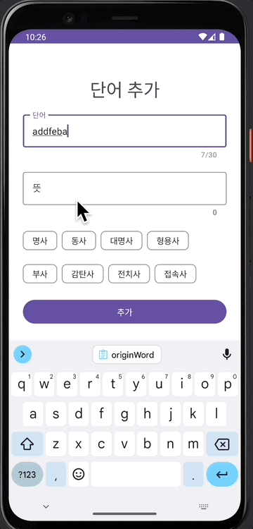
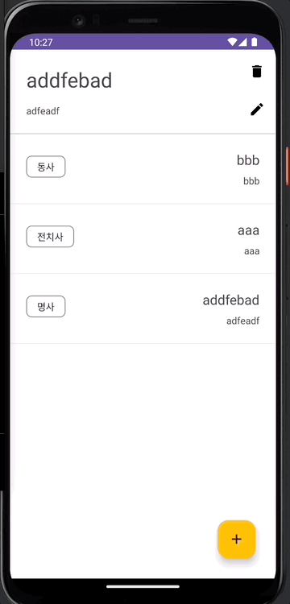
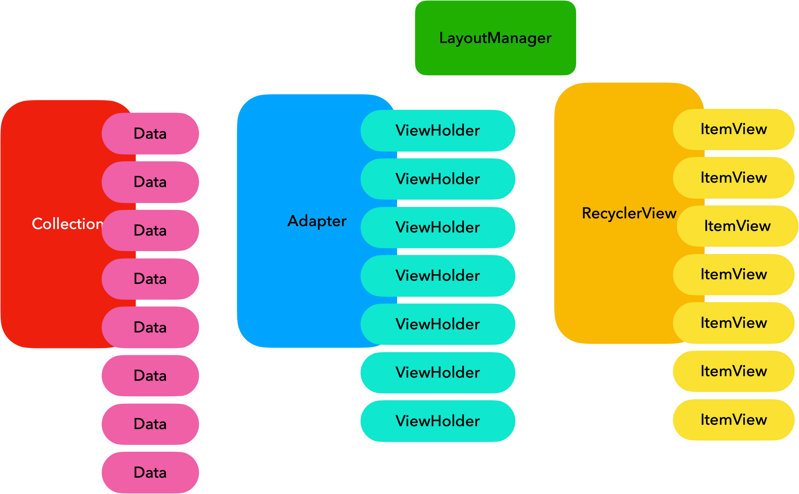
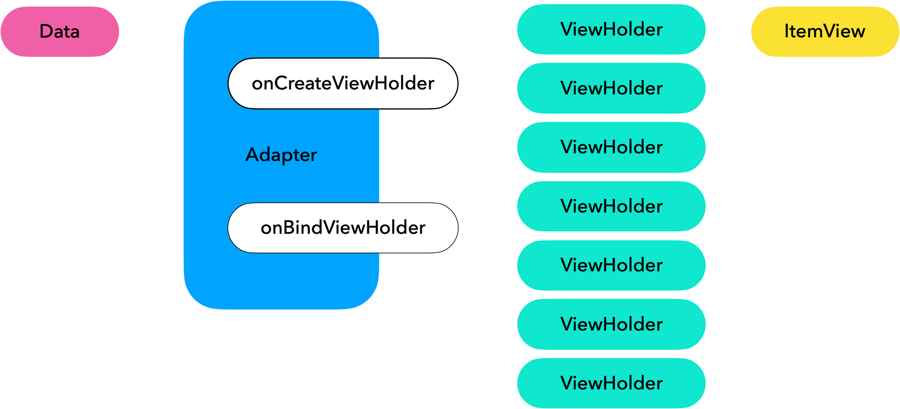

# 💬 단어장

---
## 📌 개요
- 구현 기능
  - 단어장 UI 구현
  - 단어 추가
  - 단어 수정
  - 단어 삭제

 

 

 

---
## 💪🏻 학습 목표
- 데이터를 추가, 수정, 삭제하고, UI에 변경된 내용을 보여줄 수 있음
  - Room을 이용해, 데이터 추가, 수정, 삭제
  - RecyclerView와 RecyclerViewAdapter를 이용해 리스트 그리기
  - 변경된 데이터에 다른 내용을 UI 업데이트
- UI
  - RecyclerView, Adapter
    - 어댑터로 레이아웃 빌드
  - TextInputLayout, TextInputEditText
  - ChipGroup, Chip
- Kotlin
  - data class
- Android
  - Room
  - registerForActivityResult
  - Parcelize

 

### RecyclerView

 

### RecyclerViewAdapter

 

---
## 🚶🏻 한 걸음 더
- 강의에서 구현한 방법과 다르게 RecyclerView 아이템 클릭 리스너 구현해보기
- 단어 추가 화면에서, 추가 버튼 클릭 시, 유효성 체크 해보기