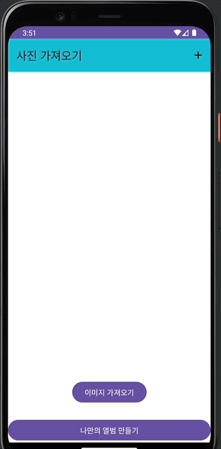
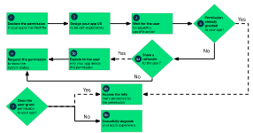

# 📢 나만의 갤러리

---
## 📌 개요
- 권한 처리
- 갤러리 이미지 가져오기
- 여러가지 타입의 리스트 구현해보기

 

 

---
## 💪🏻 학습 목표
- 갤러리에 있는 이미지를 가져오고, 다양한 이미지를 UI에 보여 줄 수 있다.
  - 갤러리에 있는 이미지를 가져오기 위한 권한 확인
  - 갤러리에서 가져온 이미지를 리스트에 업데이트
  - 다양한 타입의 아이템이 있는 리스트 구현
  - 나만의 액자 UI 만들기
  - 커스텀 툴바
- UI
  - RecyclerView, ListAdapter
    - Multiple item type
  - ViewPager2
  - Toolbar
- Kotlin
  - sealed class, data class
- Android
  - Permission
  - Storage Access Framework
  - registerForActivityResult

---
## 앱 권한 요청
- 앱이 자체 샌드박스 밖에 있는 리소스나 정보를 사용해야 하는 경우 권한을 선언하고 이 액세스를 제공하는 권한 요청을 설정할 수 있음
  
- 기본 원칙
  - 사용자가 권한이 필요한 기능과 상호작용하기 시작할 때 컨텍스트에 따라 권한을 요청함
  - 사용자를 차단하지 않는다. 항상 권한과 관련된 교육용 UI 흐름을 취소하는 옵션을 제공해야한다.
  - 사용자가 기능에 필요한 권한을 거부하거나 취소하면 권한이 필요한 기능을 사용 중지하는 등의 방법으로 앱의 성능을 단계적으로 저하시켜 사용자가 앱을 계속 사용할 수 있도록 한다.
  - 시스템 동작을 가정하지 않는다.
    - 예를 들어 동일한 권한 그룹에 권한이 표시된다고 가정하면 안된다.
    - 권한 그룹은 앱이 밀접하게 관련된 권한을 요청할 때 시스템에서 사용자에게 표시하는 시스템 대화상자의 수츨 최소화하는 데만 도움이 된다.

 

<오류사항>
- 안드로이드 13 이상 타겟팅인 경우
  - READ_EXTERNAL_STORAGE 대신
    - READ_MEDIA_IMAGES
    - READ_MEDIA_VIDEO
    - READ_MEDIA_AUDIO 등으로 나눠서 권한을 요청해야 함

### 권한 요청 워크플로

---
## 🚶🏻 한 걸음 더
- drawable을 이용해 다양한 도형을 그려보세요.
- ListAdapter와 RecyclerView.Adapter의 차이 복습해보기