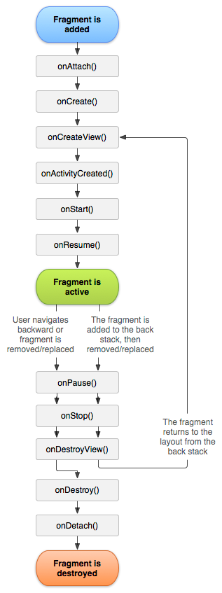

# 📢 웹툰 앱

 

 

---
## 💪🏻 이 챕터를 통해 배우는 것
- WebView 사용하기
- ViewPager2 사용하기
  - ViewPager2를 Fragment와 함께 쓰기
  - TabLayoutMediator를 통해 TabLayout과 함께 쓰기
- Fragment
- SharedPreference
- Dialog

---
## ❗️ Android 4대 컴포넌트
- Activity
- Service
- BroadCast Receiver
- Content Provider

---
## ❗️ Activity
- 사용자와 상호작용하는 화면
- 단일 독립 실행형 모듈(Activity 끼리는 독립적)
- 재사용이 가능

---
## ❗️ [Fragment](https://developer.android.com/guide/components/fragments?hl=ko)
- 여러 개의 프래그먼트를 하나의 액티비티에 결합하여 창이 여러 개인 UI를 빌드할 수 있으며, 하나의 프래그먼트를 여러 액티비티에서 재사용할 수 있다.
- 프래그먼트는 액티비티의 모듈식 섹션이라고 생각하면 된다.
- 이는 자체적인 수명 주기를 가지고, 자체 입력 이벤트를 수신하고, 액티비티 실행 중에 추가 및 삭제가 가능하다.
  - Activity에 결합하여 -> 독립적으로 사용할 수는 없다.
  - 자체적인 수명주기를 가지고 -> Activity와는 별개의 수명주기를 가진다.

 

- **onCreate()**
  - 프래그먼트를 생성할 때 시스템에서 이것을 호출함
  - 구현 내에서 프래그먼트의 기본 구성 요소 중 프래그먼트가 일시정지되거나 중단되었다가 재개되었을 때 유지하고자 하는 것을 초기화해야 함
- **onCreateView()**
  - 시스템은 프래그먼트가 자신의 사용자 인터페이스를 처음으로 그릴 시간이 되면 이것을 호출함
  - 프래그먼트에 맞는 UI를 그리려면 메서드에서 View를 반환해야 함
  - 이 메서드는 프래그먼트 레이아웃의 루트
  - 프래그먼트가 UI를 제공하지 않는 경우 null을 반환하면 됨
- **onPause()**
  - 시스템이 이 메서드를 호출하는 것은 사용자가 프래그먼트를 떠난다는 것을 나타내는 첫 번째 신호
    - 다만 항상 프래그먼트가 소멸 중이라는 것을 의미하지는 않음
  - 일반적으로 여기에서 현재 사용자 세션을 넘어서 지속되어야 하는 변경 사항을 커밋함
    - 사용자가 돌아오지 않을 수 있기 때문

---
## ❗️ [ViewPager2](https://developer.android.com/training/animation/screen-slide-2?hl=ko)
- 하나의 전체화면에 다른 전체화면으로 전환할 때 사용
- 내부 구현은 RecyclerView로 이루어짐

---
## ❗️ 웹툰 앱
- ViewPager2를 이용해 N개의 Fragment를 구성함
- 각 Fragment는 WebView를 전체화면으로 구성함
- TabLayout과 ViewPager2를 연동하고, Tab 이름을 동적으로 바꿀 수 있음
- 웹툰의 마지막 조회 시점을 로컬에 저장하고, 앱 실행 시 불러옴
