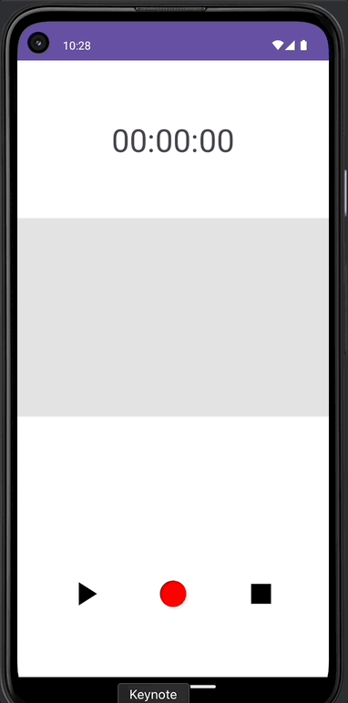
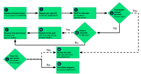

# 📢 녹음기 앱

---
## 💪🏻 이 챕터를 통해 배우는 것
- MediaPlayer
- MediaRecorder
- Permission Request
- Canvas
- Handler

 

 

---
## ❗️ [MediaPlayer](https://developer.android.com/guide/topics/media/mediaplayer?hl=ko)
- 다양한 일반 미디어 유형의 재생을 지원하므로 오디오, 동영상, 이미지를 애플리케이션에 쉽게 통합할 수 있다.
- 애플리케이션 리소스(원시 리소스)에 저장된 미디어 파일, 파일 시스템의 독립형 파일 또는 네트워크 연결을 통해 들어오는 데이터 스트림에서 모두 MediaPlayer API를 사용하여 오디오 또는 동영상을 재생할 수 있다.

 

- manifest 선언
  - <uses-permission android:name="android.permission.INTERNET"/>추가
    - 네트워크 기반 콘텐츠를 스트리밍하는 경우 애플리케이션에서 네트워크 액세스를 요청해야 한다.
  - <uses-permisison android:name="android.permission.WAKE_LOCK"/>추가
    - 플레이어 애플리케이션에서 화면이 어두워지는 것이나 프로세서의 절전 모드를 방지해야 한는 경우 권한을 추가해야 한다.

---
## ❗ [MediaRecorder](https://developer.android.com/guide/topics/media/mediarecorder?hl=ko)
- 다양한 일반 오디오 및 동영상 포맷을 캡처하고 인코딩하는 지원 기능이 포함되어 있다.
- 기기 하드웨어에서 지원되는 경우 MediaRecorder API를 사용할 수 있다.
- Android Emulator는 오디오를 녹음할 수 없음.
  - 녹음할 수 있는 실제 기기를 활용하여 테스트 진행해야 함

- 녹음하려면 앱에서 사용자에게 기기의 오디오 입력에 액세스할 것임을 알리는 메시지를 표시해야 한다.
  - 앱의 매니페스트 파일에 권한 태그를 추가해야 한다.

 

- manifest 선언
  - <uses-permission android:name="android.permission.RECORD_AUDIO"/>추가
    - RECORD_AUDIO는 사용자의 개인정보 보호에 위험을 초래할 수 있기 때문에 '위험한 권한'으로 간주된다.
    - 따라서 해당 권한을 사용하는 앱은 런타임에 사용자에게 승인을 요청해야 한다.

---
## ❗️ [Permisson](https://developer.android.com/training/permissions/requesting?hl=ko)
- 런타임 권한을 요청하기 위한 기본 원칙은 다음과 같다.
  - 사용자가 권한이 필요한 기느오가 상호작용하기 시작할 때 컨텍스트에 따라 권한을 요청한다.
  - 사용자를 차단하지 않는다. 교육용 UI 흐름(예: 권한 요청의 근거를 설명하는 흐름)을 취소하는 옵션을 항상 제공한다.
  - 사용자가 기능에 필요한 권한을 거부하거나 취소하면 권한이 필요한 기능을 사용 중지하는 등의 방법으로 앱의 성능을 단계적으로 저하시켜 사용자가 앱을 계속 사용할 수 있도록 한다.
  - 시스템 동작을 가정하지 않는다. 예를 들어 동일한 권한 그룹에 권한이 표시된다고 가정하면 안된다. 
    - 권한 그룹은 앱이 밀접하게 관련된 권한을 요청할 때 시스템에서 사용자에게 표시하는 시스템 대화상자의 수를 최소화하는 데만 도움이 된다.

