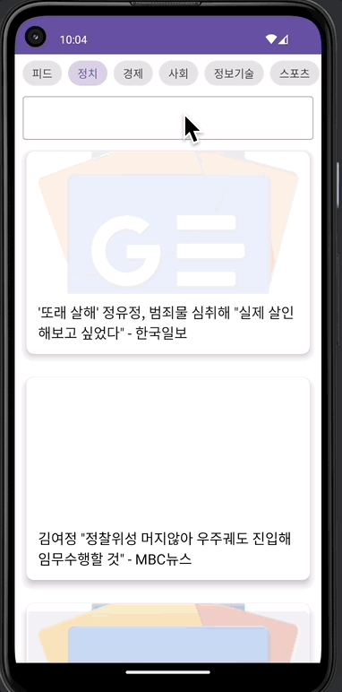

# 📢 뉴스앱

 

 

---
## 💪🏻 이 챕터를 통해 배우는 것
- Retrofit
- Material Design
  - CardView
  - Chip
- Jsoup
- Glide
- Lottie

---
### ❗️ [Tikxml](https://github.com/Tickaroo/tikxml)
- Retrofit과 함께 사용할 수 있는 XML Parser
- 0.8.15 버전이 최신 버전이지만, 안정적이지 못해 0.8.13 사용을 권장함.
- 개인적으로 마지막 릴리즈가 2018년 11월, 마지막 커밋은 2020년 7월로 오래되었기에 사용을 권장하지 않음.

 

- 그럼에도 위 라이브러리를 사용하는 이유는
  - Retrofit에서 support하고 있는 XML Parser 들은 아래 두개가 있지만,
    - [Simple XML](https://simple.sourceforge.net/) : com.squareup.retrofit2:converter-simplexml
    - [JAXB](https://docs.oracle.com/javase/tutorial/jaxb/intro/index.html) : com.squareup.retrofit2:converter-jaxb
  - Simple XML 은 Deprecated 되었고 (죽은 프로젝트)
  - JAXB 는 Android를 지원하지 않는다.
- 따라서 XML Parsing 이 필요한 상황인 경우 위 Tikxml 을 차선책으로 사용하는게 좋지만,
- 가급적이면 XML 데이터 포맷 대신 Json 형식을 사용하는 것이 좋다.

 

---
### ❗ [Material Design](https://m2.material.io/design)
- Material is a design system created by Google to help teams build high-quality digital experiences for Android, iOS, Flutter, and the web.

 

---
### ❗ [Jsoup](https://jsoup.org/)
- Java HTML Parser
- HTML을 Parsing 해야할 때 주로 사용한다.
- 크롤링과 관련한 프로젝트를 수행해야 할 경우 유용하다.
- 다만, HTML 데이터를 직접 크롤링하기보다는 서버 통신을 통한 JSON 형식의 데이터를 받는게 더 일반적이므로 자주 사용할 라이브러리는 아니다.
- 이번 프로젝트에서는 예외적인 상황으로 사용

 

---
### ❗ [Glide](https://bumptech.github.io/glide/)
- 안드로이드 이미지 로딩 라이브러리
- 매우 쉽게 네트워크를 통해 이미지를 받아올 수 있도록 도와주는 라이브러리
- 이미지 캐싱 처리가 가능하기 때문에 네트워크 이미지를 불러올 때 뿐만 아니라 로컬 이미지를 불러올 때와 같은 상황에서도 사용이 용의하다.
- gif 이미지를 불러올 때도 유용하게 사용할 수 있다.

 

---
### ❗ [Lottie](https://airbnb.io/lottie/#/)
- Airbnb 에서 만든 애니메이션 처리 라이브러리
- json 파일 형식으로 데이터를 불러와 간편하게 개발자가 디자이너에게 전달받은 애니메이션을 그려줄 수 있다.

