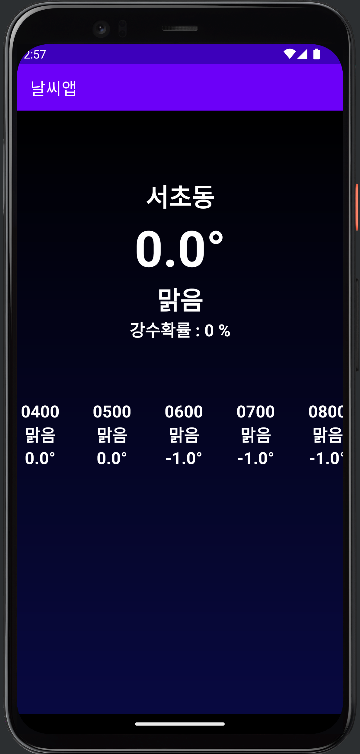
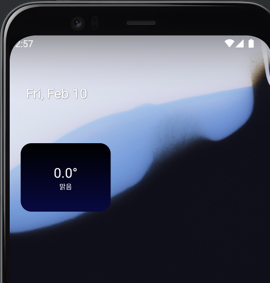

# 📢 날씨앱

---

 

 

---
## 💪🏻 이 챕터를 통해 배우는 것
- Location
- Foreground Service
- Android Widget
- 공공데이터포털

---
### ❗️ [Location](https://developer.android.com/training/location/permissions?hl=ko)
- 대략적인 위치 vs 정확한 위치
  - 대략적인 위치
    - ACCESS_COARSE_LOCATION 권한을 통해 받을 수 있음
    - 런타임 권한
    - 오차범위는 3km 이내
    - 정확한 위치가 필요 없는 경우는 대략적인 위치권한만 사용하자(날씨앱 등)
  - 정확한 위치
    - ACCESS_FINE_LOCATION 권한을 통해 받을 수 있음
    - 런타임 권한
    - 오차범위는 50m 이내
    - Android 12 (API 13) 이후부터는 사용자가 대략적인 위치 권한만 허용할 수 있으므로, targetSDK가 31 이상일 경우 두 권한을 동시에 요청하자.

 

- 포어그라운드 위치 vs 백그라운드 위치
  - 포어그라운드 위치
    - 앱을 사용하는 중 요청하는 위치 권한(백그라운드 위치 권한과는 별개)
  - 백그라운드 위치 
    - 앱의 기능이 Android 10(API 수준 29)을 실행하는 기기에서 백그라운드 위치를 요청하면 시스템 권한 대화상자에는 항상 허용이라는 옵션이 포함된다.
    - 사용자가 이 옵션을 선택하면 앱의 기능에 백그라운드 위치 정보 액세스 권한이 부여된다.
    - ACCESS_BACKGROUND_LOCATION 권한이 필요하다.
    - 매우 위험할 수 있는 기능이므로 Google Play 스토어에서는 엄격한 위치 정책을 적용하고 있다.

---
### ❗️ Foreground Service
- 앱이 API 레벨 26 이상을 대상으로 한다면 앱이 포그라운드에 있지 않을 때 시스템에서 백그라운드 서비스 실행에 대한 제한을 적용한다.
- [서비스 개요](https://developer.android.com/guide/components/services?hl=ko)
- [Foreground services](https://developer.android.com/guide/components/foreground-services)
- 사용자 개인정보를 보호하기 위해 Android 11(API 레벨 30)에서는 포그라운드 서비스가 기기의 위치, 카메라 또는 마이크에 액세스할 수 있는 경우에 대한 제한을 도입한다.
- 앱이 백그라운드에서 실행되는 동안 포그라운드 서비스를 시작하면 포 그라운드 서비스에 다음과 같은 제한이 있다.
  - ACCESS_BACKGROUND_LOCATION
    - 사용자가 앱에 권한을 부여하지 않으면 포그라운드 서비스가 위치에 액세스할 수 없다.
    - 포그라운드 서비스는 마이크나 카메라에 액세스할 수 없다.

---
### ❗️ [Android Widget](https://developer.android.com/guide/topics/appwidgets?hl=ko)

---
### ❗️ [공공데이터 포털](data.go.kr)
- 정부에서 제공하고 있는 데이터를 활용 신청하여 사용할 수 있음
- 이번 날씨앱에서는 기상청에서 제공하는 단기예보조회 API를 활용할 예정
