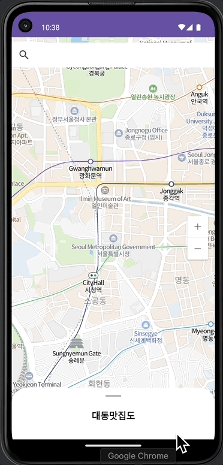

# 📢 대동맛집도

---

 

 

---
## 💪🏻 이 챕터를 통해 배우는 것
- NaverMap
- Naver Open API
- BottomSheetBehavior
- Moshi

---
## 📌 [NaverMap](https://navermaps.github.io/android-map-sdk/guide-ko/1.html)
- 네이버 지도 SDK는 네이버 지도 앱을 비롯한 네이버의 여러 서비스에서 사용 중인 지도 엔진이다.
- 대규모 사용자가 이용하는 서비스에 다년간 적용되어 기능과 안정성이 보장된다.
- 또한 개발자 친화적인 API를 제공하므로 SDK가 제공하는 강력한 기능을 쉽게 사용할 수 있다.
- 네이버 지도 SDK는 네이버 지도같은 복잡한 서비스에서 요구되는 다양한 기능을 모두 수용하는 강력한 기능을 제공한다.

---
## 📌 [Naver Open API](https://developers.naver.com/docs/common/openapiguide/)
- 네이버 플랫폼의 정보를 외부 개발자가 쉽게 이용할 수 있도록 제공하는 API
- 사용 API : [검색 API(지역)](https://developers.naver.com/docs/serviceapi/search/local/local.md#%EC%A7%80%EC%97%AD)

---
## 📌 [Bottom Sheet Behavior](https://m2.material.io/develop/android/components/bottom-sheet-dialog-fragment)
- CoordinatorLayout
  - FrameLayout 기반의 강력한 상호작용 레이아웃
  - 자식 Behavior 들과의 이동 및 애니메이션 작용 등을 다룰 때 사용할 수 있음.
    - AppBarLayout의 스크롤 시 크기 변경
    - 하단 FloatingButton의 스크롤 시 위치 변경 등

---
## 📌 Moshi
- Moshi is a modern JSON library for Android, Java and Kotlin.
- It makes it easy to parse JSON into Java and Kotlin classes
- 최근에 많이 사용되는 라이브러리

 

- [Gson](https://github.com/google/gson)
  - Java로 구현되어 있음
  - Star : 21.8k
  - until 2008
- [Moshi](https://github.com/square/moshi)
  - Kotlin으로 구현되어 있음
  - Star : 8.7k
  - until 2015