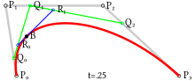

# 📢 얼굴 인식 서비스

 

 

---
## 💪🏻 개요 및 학습목표

- 카메라 프리뷰 활성화
- 얼굴 인식 모듈 설치
- 얼굴 인식 범위 Mask 씌우기
- 간단한 요구사항을 통한 상호작용
- 인식 진행 사항 출력

---
## ❗️ 구현에 필요한 기술들

- Module
- CameraX Preview
- Permission
- Google Vision
- CustomView - Paint
- Bezier Curves
- PathMeasure

---
### ⁉️ CameraX

- 더 쉬운 카메라 앱 개발을 위해 빌드된 Jetpack 라이브러리
  - Camera2를 사용하므로 Android 5.0(API level 21)까지만 지원
  - 미리보기, 이미지 분석, 이미지 캡쳐, 동영상 캡쳐 지원
  - 생명주기를 인식
  - 장치 호환성 문제를 해결함으로써 기기별 분기코드 감소
  - 특정 디바이스에 종속되는 Bokeh, HDR 등 지원

---
### ⁉️ 베지에 곡선(Bezier Curve)

- 매끄러운 곡선을 그리기 위한 것
- 조절점을 따라 이은 직선1과 직선1을 따라 이은 직선2
- 직선2 위에서 일정하게 움직이는 점이 그리는 궤적을 의미함

 

--- 
### ⁉️ 얼굴 인식

- 얼굴 특징 인식 및 위치 찾기
- 얼굴 특징의 윤곽 가져오기
- 표정 인식
- 동영상 프레임에서 얼굴 추적
- 동영상 프레임에서 실시간으로 처리
- [ml-kit](https://developers.google.com/ml-kit/vision/face-detection)을 활용

---
### 💬 얼굴인식 프로젝트 복습 QUIZ
1. CameraX에서 제공하는 최소 Android OS 버전은? : Android 5.0
   - CameraX는 대부분의 Android 기기에서 작동하며 이전 버전인 Android 5.0(API 수준21)까지 호환되는 일관되고 사용하기 쉬운 API를 제공한다.
2. 3차 베지에 곡선(Bezier curve)에서 설정해야 하는 조절점은 총 몇개인가? : 4개
   - 시작점을 포함한 조절짐이 3개이면 2차 베지에 곡선, 4개면 3차 베지에 곡선, 5개면 4차 베지에 곡선이라고 부른다.
3. Custom View를 구성할 때, Paint를 실제 View에 출력하는 작업을 하는 곳은? : onDraw
   - onDraw 부분에서 Canvas를 사용하여 UI를 그린다.
4. CameraX의 특징
   - 장치 호환성 문제를 해결함으로써 기기 별 분기 코드가 감소되었다.
   - 특정 디바이스에 종속되는 Bokeh, HDR 등을 지원한다.
   - 카메라를 여는 시점, 캡처 세션을 생성할 시점, 중지 및 종료 시점을 결정하기 위해 수명 주기를 따른다.
   - 미리보기, 이미지 분석, 이미지 캡처, 동영상 캡처를 지원한다.
5. Path를 따라서 Progress를 그리려면 어떤 것을 사용해야 하나? : AnimationDrawable
   - AnimationDrawable과 달리 PathMeasure는 Path를 어디부터 어디까지 그릴지 지정할 수 있도록 한다.