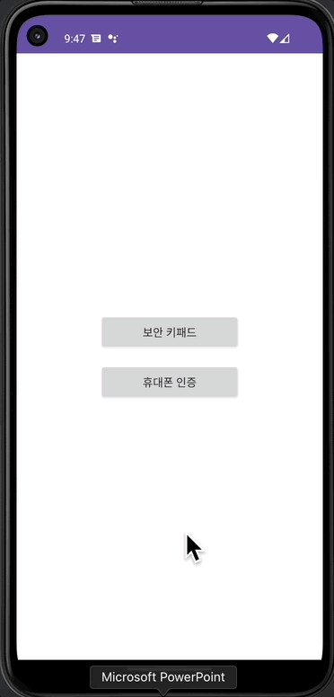
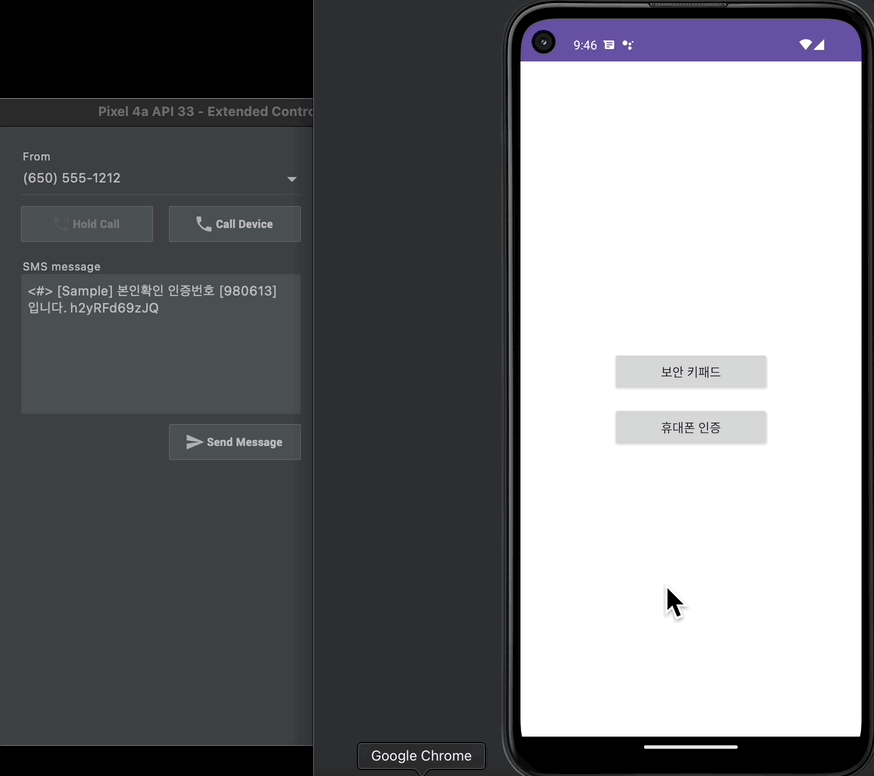

# 📢 금융 서비스(보안 키패드 / 휴대폰 인증)

 

 

---
## ❗️ 금융 서비스

- 보안(셔플) 키패드 구성
- 머티리얼 디자인 적용
- 휴대폰 인증 One Task UI 구성
- Timer를 활용한 인증번호 입력시간 제어
- 문자 자동 인식 기능

---
## 💪🏻 구현에 필요한 기술들

- GridLayout
- DataBinding
- BindingAdapter
- 정규 표현식
- TextInputLayout
- CountDownTimer
- SmsRetriever

---
## 💬 프로젝트 복습 QUIZ

1. GridLayout에서 열의 개수를 지정할 때 사용하는 속성은? columnCount
2. "^[가-힣]{2,}$"의 정규표현식의 설명 : 가 부터 힣까지 두글자 이상만 가능하다.
3. TextInputLayout의 endIconMode 속성 중 삭제 아이콘을 지정하는 방법
    - clear_text로 삭제 아이콘을 쉽게 추가할 수 있다.
4. SmsRetriever의 특징 : SMS 권한이 없이도 SMS 내용을 읽을 수 있다.
5. 인증 번호를 자동으로 입력 받기 위한 조건에 대해
    - 맨앞에 '<#>'가 반드시 포함되어야 함
    - 문자내용이 140byte를 초과하면 안 된다.
    - 맨마지막에 앱을 식별하는 11글자 해시문자열을 포함해야 한다.