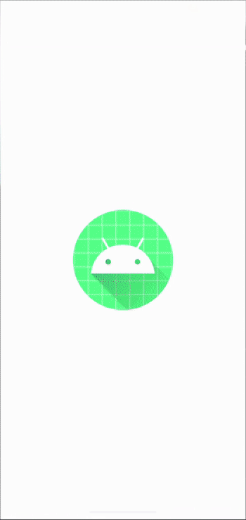

# 📢 월렛 서비스

- 카드 모음 구성
- 카드 선택 시 넘어가는 애니메이션
- 상세화면 전환 애니메이션
- 상세 내역 리스트 구현

 

 

---
## 💪🏻 구현에 필요한 기술들

- MotionLayout
  - MotionLayout을 활용한 카드 선택 애니메이션 구현
- DataBinding
- BindingAdapter
- Shared Elements Transition
  - Shared Element Transition을 통한 Activity 전환 간 애니메이션
- RecyclerView
  - RecyclerView를 통한 상세 내역 리스트 구현

---
### ⁉️ MotionLayout에 대해

- MotionLayout
  - 앱에서 모션과 애니메이션을 관리하는 데 사용할 수 있는 레이아웃 유형
  - ConstraintLayout의 서브클래스
  - Property animaiton, TransitionManager, CoordinatorLayout의 혼합체
  - UI를 움직이거나 사이즈를 조정하고 싶을 때, 유저와 직접적으로 상호작용 할 때 유용

 

- MotionScene
  - ConstraintSet, KeyFrame, Transition 등 애니메이션 정보를 포함한 xml
- Transition
  - 모션의 기본 정의가 포함. 시작과 종료, 애니메이션 시간을 설정
- OnSwipe
  - 터치 모션을 제어. Swipe 애니메이션을 실행, 제어
- OnClick
  - 클릭 모션을 제어. Click 애니메이션을 실행, 제어
- KeyFrameSet
  - 자연스럽게 애니메이션에 커브를 적용하거나 모핑을 시도할 수 있음
- KeyPosition
  - 키프레임에서 뷰의 위치를 지정
- KeyAttribute
  - 키프레임에서 뷰의 속성을 지정
- KeyCycle
  - 이전 state에서 해당 프레임 포지션까지 특정 속성들을 진동시킴
- ConstraintSet
  - 모션에 대한 제약조건을 설정. ConstraintSet 태그 안에 Constraint 태그를 통해 뷰들의 위치를 지정
- Constraint
  - MotionLayout에 작성된 뷰들의 위치를 설정
- CustomAttribute
  - 뷰의 위치, 속성의 전환을 설정

 

- MotionLayout 유형
  - BackgroundColor
  - KeyFrameSet
  - KeyCycle
  - CoodinatorLayout
  - DrawerLayout
  - ViewPager
  - YouTube
  - MultiState