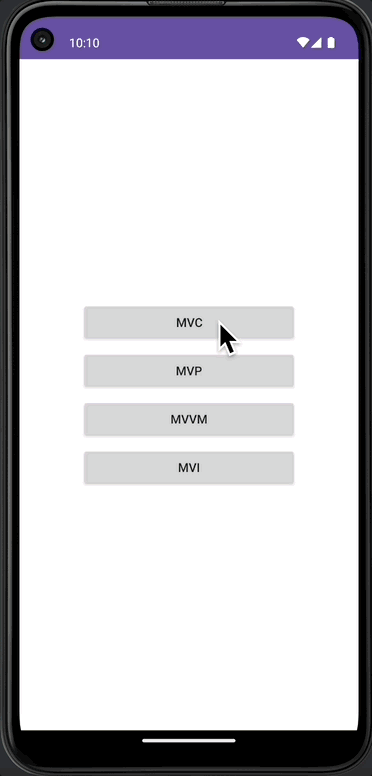
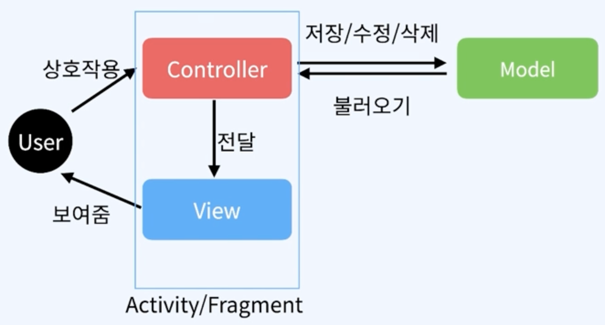
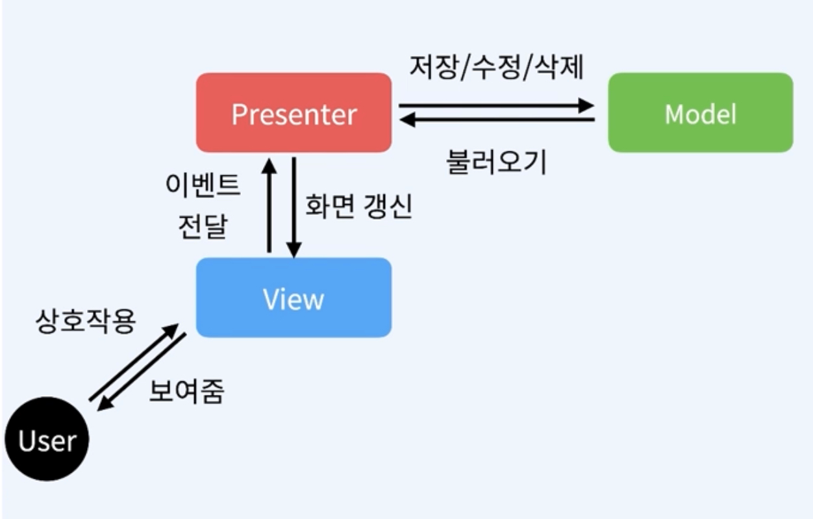
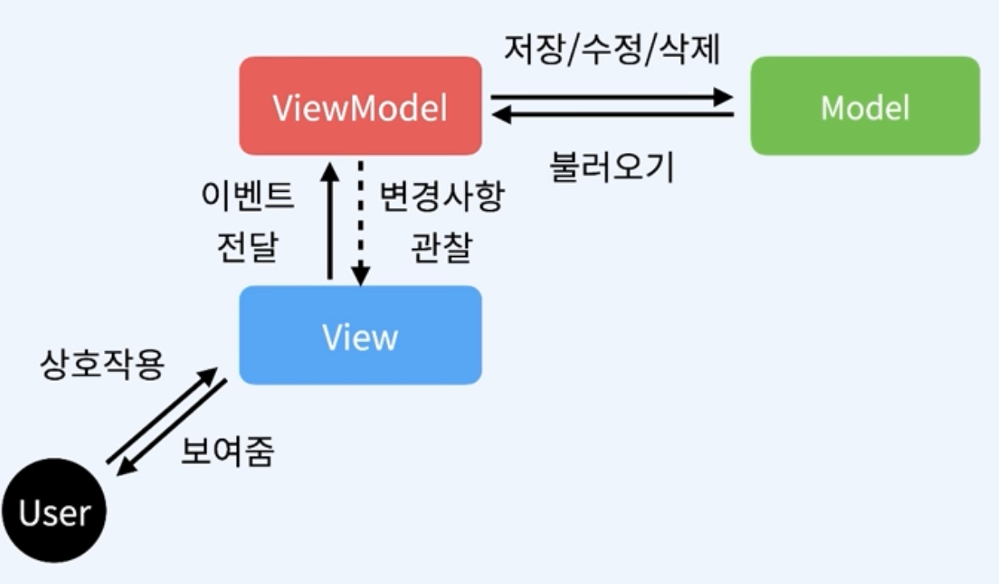
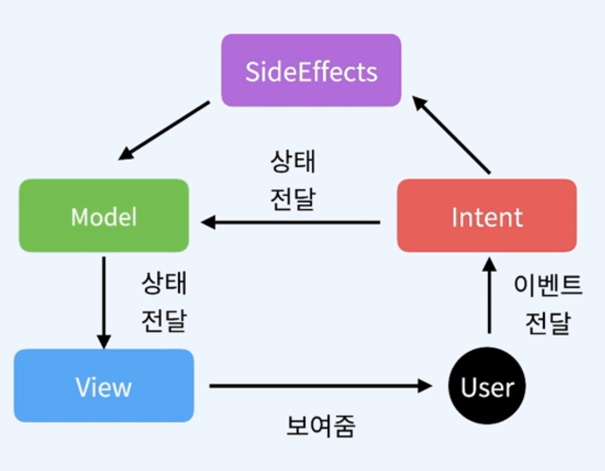

# 📢 이미지 추출 앱

 

 

- Open API를 활용한 랜덤 이미지 불러오기 구현
- MVC, MVP, MVVM, MVI 패턴으로 코드 작성

---
## 💪🏻 이 챕터에서 사용한 기술
- [Retrofit2](https://square.github.io/retrofit/)
- [Coil](https://coil-kt.github.io/coil/)
- [MVC](https://ko.wikipedia.org/wiki/%EB%AA%A8%EB%8D%B8-%EB%B7%B0-%EC%BB%A8%ED%8A%B8%EB%A1%A4%EB%9F%AC)
- [MVP](https://ko.wikipedia.org/wiki/%EB%AA%A8%EB%8D%B8-%EB%B7%B0-%ED%94%84%EB%A6%AC%EC%A0%A0%ED%84%B0)
- [MVVM](https://ko.wikipedia.org/wiki/%EB%AA%A8%EB%8D%B8-%EB%B7%B0-%EB%B7%B0%EB%AA%A8%EB%8D%B8)
- [MVI](https://jaehochoe.medium.com/%EB%B2%88%EC%97%AD-%EC%95%88%EB%93%9C%EB%A1%9C%EC%9D%B4%EB%93%9C%EB%A5%BC-%EC%9C%84%ED%95%9C-mvi-model-view-intent-%EC%95%84%ED%82%A4%ED%85%8D%EC%B3%90-%ED%8A%9C%ED%86%A0%EB%A6%AC%EC%96%BC-%EC%8B%9C%EC%9E%91%ED%95%98%EA%B8%B0-165bda9dfbe7)

---
## 📌 MVC 패턴이란?
- Model
  - 데이터를 관리
  - 비즈니스 로직 수행
- View
  - 유저에게 보일 화면을 표현
  - 어떠한 데이터나 로직이 있으면 안됨
- Controller
  - Model과 View를 연결
  - 유저의 입력을 받고 처리

- 장점
  - 가장 구현하기 쉽고 단순함
  - 개발기간이 짧아짐
  - Model과 View를 분리
  - Model의 비종속성으로 재사용 가능
- 단점
  - Controller에 많은 코드가 생김
  - 유지보수의 어려움
  - View와 Model의 결합도 상승
  - 테스트코드 작성의 어려움
  - 현재는 많이 사용하지는 않지만 규모가 작고 빠르게 어플을 만들어야 하는 경우 사용

 

---
## 📌 MVP 패턴이란?
- Model
  - 데이터를 관리
  - 비즈니스 로직 수행
- View
  - 유저에게 보일 화면을 표현
  - Presenter에 의존적
- Presenter
  - Model과 View를 연결
  - View에 Interface로 연결

- 장점
  - View와 Model 간의 의존성이 없음
  - UI와 비즈니스 로직 분리
  - Unit Test 수월
- 단점
  - View와 Presenter가 1:1 관계
  - View가 많아지면 Presenter도 많아짐
  - 기능이 추가 될수록 Presenter가 비대해짐

 

---
## 📌 MVVM 패턴이란?
- Model
  - 데이터를 관리
  - 비지니스 로직 수행
- View
  - 유저에게 보일 화면을 표현
  - ViewModel의 데이터를 관찰
- viewModel
  - Model과 View를 연결
  - DataBinding과 LiveData를 통해 View에 데이터를 전달

- 장점
  - View가 데이터를 실시간으로 관찰
  - 생명주기로부터 안전
  - View와 ViewModel 결합도가 느슨
  - 모듈별로 분리하여 개발 가능
  - Unit Test 수월
- 단점
  - 다른 디자인 패턴에 비해 복잡
  - DataBinding, LiveData 등 다른 라이브러리를 필수적으로 학습

 

---
## 📌 MVI 패턴이란?
- Model
  - 모든 상태를 나타냄
- View
  - 유저에게 보여지는 화면
  - 상태를 받아 화면에 표시
- Intent
  - 앱 내에서 발생하는 Action
- SideEffects
  - 상태 변경이 필요 없는 API나 DB 접근 등의 이벤트

- 장점
  - 하나의 상태만 관리하기 때문에 상태 충돌이 없다
  - 선순환 구조라 흐름을 이해하기 쉬움
  - 불변 객체이기 때문에 스레드에 안전
- 단점
  - 다른 패턴에 비해 러닝커브가 높다
  - 작은 변경에도 Intent를 거쳐야 함
  - 보일러플레이트 코드가 발생한다