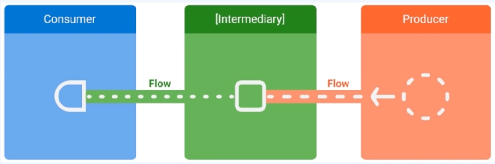

# 📢 쇼핑몰 앱

 

 

- 여러 뷰타입의 Json을 동적으로 List에 표현
- List 공통화
  - 거의 모든 페이지에 대해 특별한 개발없이 리스트 출력 가능
  - View 타입이 추가되거나 삭제될 때도 한 쪽에서만 수정 가능하기 때문에 유지보수 측면에서도 이점
- DI 적용
  - Dependency Injection
  - Hilt 사용
- Coroutine, Paging3 적용

---
## 💪🏻구현에 필요한 기술들

- MVVM
- Hilt
- Coroutine
- Flow
- Paging3
- JsonDeserializer

 

- 완성 기술
  - CoordinatorLayout으로 AppBar 접히는 부분 구현
  - 복잡한 ViewType의 Json 파싱
  - 파싱한 데이터를 동적으로 처리
  - API 내용의 변화에 클라이언트 코드 수정 X
  - Coroutine, Flow 사용
  - DI(Hilt) 사용

---
## 📌 [Hilt란?](https://developer.android.com/training/dependency-injection/hilt-android?hl=ko)

Google Dagger를 기반으로 만든 Dependency Injeciton 라이브러리

Android App에 특화된 DI
- Android class에 의존성 주입을 지원하고 생명 주기를 자동으로 관리

---
## 📌 Coroutine이란?

- 비동기적으로 실행되는 코드를 간소화하기 위해 Android에서 사용할 수 있는 동시 실행 설계 패턴
- Kotlin 1.3에 추가 / 일종의 경량 스레드

 

#### 코루틴 구성 요소

- CoroutineContext : 코루틴이 실행될 Context
  - 코루틴 처리를 어떻게 할 것 인지에 대한 요소들이 집합
  - CoroutineContext 요소
    - Dispatcher : 코루틴을 처리할 스레드를 Setting하고 할당하는 역할
      - Main : 메인 스레드
      - I/O : I/O 작업하는데 최적화되어 있는 스레드
      - Default : CPU 사용량이 많은 작업을 할 때 실행
      - Unconfined : 다른 Dispatchers와 달리 특정 스레드를 지정하지 않음
    - Job : 생성된 코루틴을 컨트롤(생명 주기, 부모 자식 관계 정리 및 관)
- CoroutineScope : 코루틴을 제어할 수 있는 범위
  - 코루틴 처리를 어떻게 할 것 인지에 대한 요소들의 집합
    - GlobalScope : Application Lifecycle
    - CoroutineScope : Scope안의 작업이 끝날 때까지
    - ViewModelScope : ViewModel Lifecycle
- Builder : 코루틴을 실행하는 함수
  - 코루틴을 생성하는 메소드
    - launch : Job()을 반환. 결과는 Return 하지 않음(실행 후 망각)
    - async : Deferred<T> 객체를 리턴. await()로 결과를 Return
    - withContext : Context를 변환. await() 없이 결과를 Return
    - runBlocking : 결과를 반환 할 때까지 현재 스레드를 중
- suspend function : suspend 키워드가 붙은 코루틴 안에서 실행시키려는 함수

---
## 📌 Flow란?

- 여러 값을 순차적으로 내보낼 수 있는 유형
- 생산자 : 스트림에 추가되는 데이터를 생산
- 중개자 : 스트림에 내보내는 각각의 값이나 스트림 자체를 수정
- 소비자 : 스트림의 값 사용

---
## 📌 Paging3이란?

- 데이터를 순차적으로 불러 올 수 있는 Jetpack 라이브러리

 

#### 라이브러리 아키텍처

---
### 📌 List Item을 동적으로 서버로부터 받아와서 그려주려면 어떻게 해야할까?