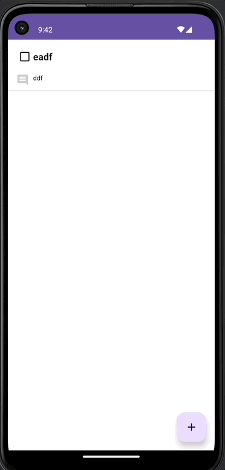
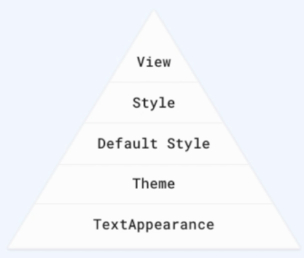

# 📢 TODO 앱

 

 

- DI 적용
- Room을 이용해 내부 DB 접근
- Style/Theme 적용

---
## 💪🏻 구현에 필요한 기술들

- MVVM
- Hilt : DI 적용
- Coroutine : 비동기 처리
- Flow
- Room

---
### 📌 Room이란?

- AAC(Android Architecture Components)로써 Android 내장 DB에 데이터를 저장하기 위해 사용하는 ORM 라이브러리
- SQLITE 대신 Room을 사용해야하는 이유
  - 컴파일 도중 SQL에 대한 유효성 검사 가능
  - Schema가 변경될 시 자동으로 업데이트 가능
  - Java 데이터 객체를 변경하기 위해 상용구 코드 없이 ORM 라이브러리를 통해 매핑 가능
  - LiveData와 RX Java를 위한 Observation 생성 및 동작 가능

 

 

- 구성요소
  - Entity
  - DAO(Data Access Objects)
  - Room DataBase

---
### ❗ 디자인 가이드가 변경되면 한번에 적용하는 방법이 있을까?

- Android Styling System을 활용하면 된다.

1. View Attirubtes
   - 각각의 view 속성을 명시적으로 설정
   - 다만 view의 속성은 재사용 불가
   - Theme나 Style을 통해 설정하는 모든 속성을 view attribute에 사용할 수 있음
2. Styles
   - 작은 디자인 모음을 정의할 때 사용
   - 여러 뷰에 일관된 스타일을 제공
3. Defualt Style
   - 안드로이드 기본 Style
4. Themes
   - 안드로이드 전체의 색상을 정의 및 기본 글꼴 등을 설정할 수 있음
   - 앱 전체에 일관되게 적용시킬 속성에 대해 정의함
5. TextApearance
   - FontFamily와 같은 텍스트 속성에 대해서만 사용