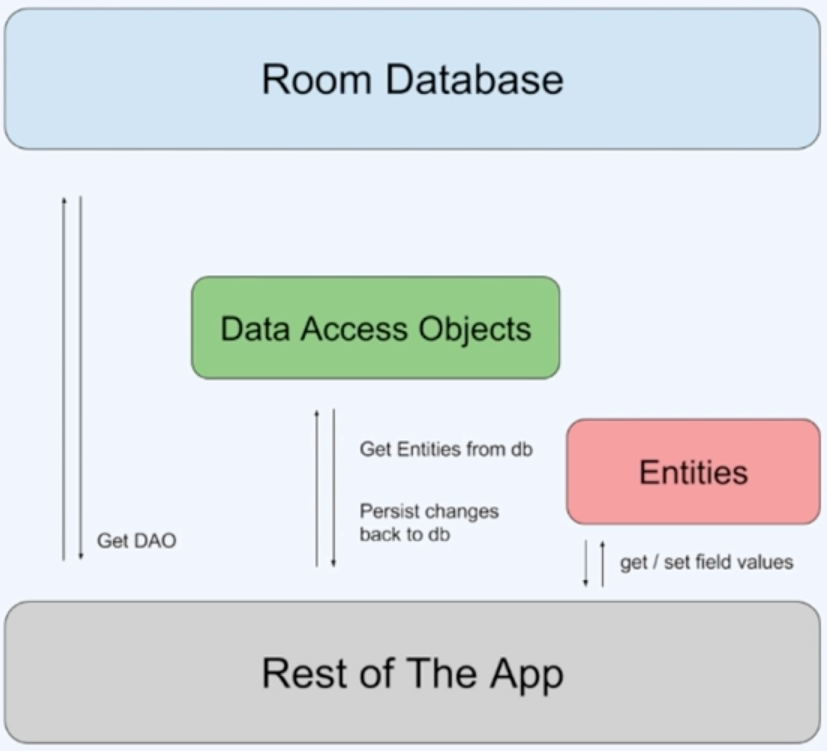

# 📢 TODO 앱

 

gif

 

- DI 적용
- Room을 이용해 내부 DB 접근
- Style/Theme 적용

---
## 💪🏻 구현에 필요한 기술들

- MVVM
- Hilt : DI 적용
- Coroutine : 비동기 처리
- Flow
- Room

---
### 📌 Room이란?

- AAC(Android Architecture Components)로써 Android 내장 DB에 데이터를 저장하기 위해 사용하는 ORM 라이브러리
- SQLITE 대신 Room을 사용해야하는 이유
  - 컴파일 도중 SQL에 대한 유효성 검사 가능
  - Schema가 변경될 시 자동으로 업데이트 가능
  - Java 데이터 객체를 변경하기 위해 상용구 코드 없이 ORM 라이브러리를 통해 매핑 가능
  - LiveData와 RX Java를 위한 Observation 생성 및 동작 가능

 

 

- 구성요소
  - Entity
  - DAO(Data Access Objects)
  - Room DataBase