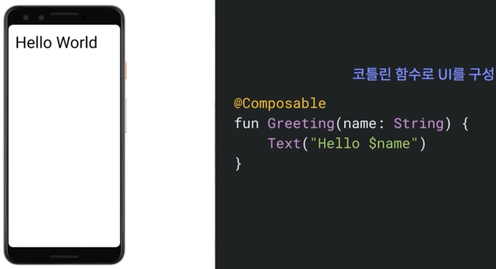

# Jetpack Compose

---
## [Jetpack Compose](https://android-developers.googleblog.com/2021/07/jetpack-compose-announcement.html)란?

- Jetpack Compose는 Android를 위한 현대적인 선언형 UI 도구 키트(2021년 7월 28일 런칭)
- 기본적인 형태는 코틀린 함수로 UI를 구성하도록 되어 있음
  - 

---
## Jetpack Compose의 장점 및 적용 사례

- 상호작용
  - 컴포즈는 기존 앱과 상호작용 가능함
  - View들을 컴포즈 UI안에 넣을 수 있고 컴포즈를 뷰 안에 넣을 수 있음
- 젯팩 통합
  - Compose는 Jetpack과 통합되도록 설계됨
  - Navigation, Paging, LiveData, Flow/RxJava, ViewModel, Hilt
- 머터리얼
  - 머터리얼 디자인 컴포넌트와 테마를 제공
  - 아름다운 앱을 만들고 브랜드를 표현
  - 복잡한 XML을 다루지 않고 이해하기 쉽고 추적하기 쉬움
- 코드의 규모가 작아짐
- 코드를 추적하기 훨신 쉬워짐
- 복잡한 구성요소의 코드도 쉽게 읽을 수 있음
- 테마 레이어가 훨씬 더 직관적이고 읽기 쉬움
- 안드로이드 스튜디오에서 미리보기 기능을 통해 시간을 절약할 수 있음
- 애니메이션 추가를 쉽게 할 수 있음

 

- 트위터의 경우
  - Twitter 앱은 10년에 걸친 레거시 앱이 있었음
  - 확장 가능한 디자인 시스템 구축을 원함
  - 컴포즈 선택
    - 사용 및 유지관리가 용이한 stateless UI 콤포넌트
    - 확장과 커스터마이징이 편함
    - 컴포넌트 단위로 레거시 설정에 의존하지 않고 변경함

- 스퀘어의 경우
  - 스퀘어는 POS, 결제 등을 만드는 회사
  - Retrofit, OkHttp, Dagger 1, Picasso, Moshi, Javapoet 오픈소스 라이브러리 강자
  - Square는 이미 선언형 도구(Workflow)로 앱을 개발했었음. MVI에 가까운 Unidirectional Data Flow.
  - 하지만 UI는 Mosaic란 내부 툴을 사용했지만 Jetpack Compose로 변경
  - Android 도구와의 통합의 장점이 있음

- Google Play의 경우
  - 10년 이상된 레거시 기술 부채
  - 네트워크 계층부터 픽셀 렌더링까지 다년간 마이그레이션 로드맵을 만듦
  - 현대적이고 선언적인 대안을 찾다 알파 버전의 Compose를 도입하기로 결정
  - 50%가 적은 코드로 UI를 작성
  - 가장 크게 고려했던 부분
    - 개발자 생산성
      - 수백명의 엔지니어가 개발하기 편하고 재밌어야 함
    - 성능
      - 지연시간과 버벅거림이 민감한 비지니스
      - Android Go 디바이스 대응해야 함.

---
## 선언형?

- 선언형의 사전적 의미 : 어떻게 무엇을 할지 대신 무엇을 하는지 기술하는 법
- UI = f(state)라고도 이야기 

 

#### React의 선언형 정의

- 인터액티브한 UI를 고통없이 만들게 함.
- 앱에서 각 상태의 심플한 뷰를 디자하면, 데이터가 변경될 때 리액트가 효율적으로 갱신하고 필요한 구성요소만 렌더링함.